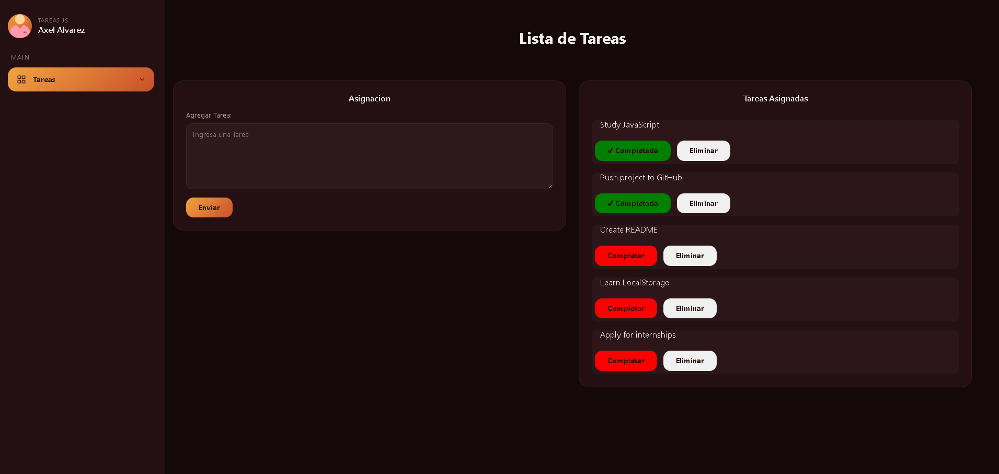
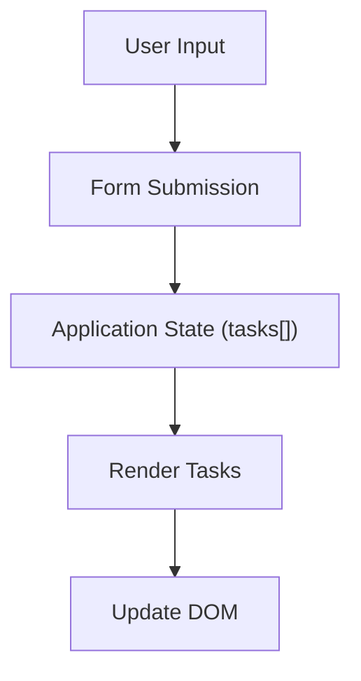

# 📝 To-Do List App

A responsive web application for managing daily tasks. It features a modern dashboard interface with a dark sidebar and orange accent colors.

Built with **HTML5**, **CSS3**, and **Vanilla JavaScript**, without external frameworks or libraries.



---

## ✨ Features

- ➕ Add new tasks.
- ✅ Mark tasks as completed.
- 🗑️ Delete tasks.
- 🎨 Responsive dashboard layout.
- ⚡ Dynamic DOM rendering.
- 📋 State-based task management.
- 🧭 Sidebar navigation interface.

---
## 🛠️ Technologies

- **HTML5** — Semantic page structure.
- **CSS3** — Flexbox, CSS Grid, and Media Queries for responsive design.
- **Vanilla JavaScript (ES6)** — Dynamic DOM manipulation and application logic.
- **Git** — Version control.
- **GitHub** — Source code hosting and project management.

---

## 🏗️ Architecture


---

## 📁 Project Structure

```text
todo-list-app/
│
├── assets/              # README images
│   └── image.png
│
├── css/                 # Stylesheets
│   ├── normalize.css
│   └── style.css
│
├── img/                 # Project images and icons
│   ├── user.png
│   └── r.png
│
├── js/                  # Application logic
│   ├── modernizr.js
│   └── script.js
│
├── index.html           # Main HTML page
├── README.md
└── .gitignore
```

---

## 🚀 Getting Started

This is a static web application, so no installation or external dependencies are required.

1. Clone the repository:

```bash
git clone https://github.com/Axraje/todo-list-app.git
```

2. Navigate to the project folder:

```bash
cd todo-list-app
```

3. Open `index.html` in your browser, or use the **Live Server** extension in Visual Studio Code for automatic reloading during development.

---

## 📚 What I Learned

During this project, I learned how to:

- Manage application state using JavaScript arrays.
- Render the UI dynamically instead of writing HTML manually.
- Handle user interactions with Event Delegation.
- Manipulate arrays using `map()` and `filter()`.
- Organize a project using Git and GitHub.
- Build a responsive interface using Flexbox and CSS Grid.

---

## 🔮 Future Improvements

- 💾 Save tasks using Local Storage.
- ✏️ Edit existing tasks.
- 🔍 Search tasks.
- 📂 Filter tasks by status.
- 🌙 Add Dark/Light mode.
- 📅 Add due dates for tasks.

---

## 👨‍💻 Author

Developed by **Axel Alvarez**.

- GitHub: [@Axraje](https://github.com/Axraje)


---

## 📄 License

This project is licensed under the MIT License. See the `LICENSE` file for more information.
